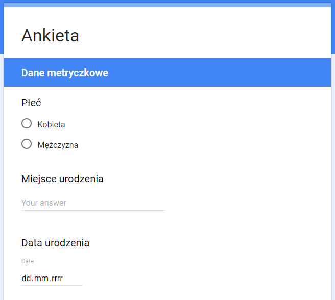

# Zbiorowość, jednostka, cecha {#zbiorowosc}

> Dane, dane, dane! - wołał niecierpliwie - Nie mogę lepić cegieł nie mając gliny.
> 
> -- <cite>Przygoda w Copper Beeches, Artur Conan Doyle</cite>

Statystyk do pracy potrzebuje danych. Te mogą być pozyskiwane na wiele różnych sposobów. Najpopularniejszym sposobem zbierania danych są badania ankietowe. Mogą być realizowane praktycznie przez każdego - osoby fizyczne (np. studentów), firmy, ośrodki badania opinii publicznej, administrację rządową, itd. W Polsce podmiotem odpowiedzialnym za przeprowadzanie badań społecznych jest Główny Urząd Statystyczny. Dzięki prowadzonym badaniom ankietowym dostarcza informacji na temat praktycznie każdej dziedziny życia obywatela Polski. Przykładowym badaniem prowadzonym przez GUS jest Badanie Aktywności Ekonomicznej Ludności. Zebranie informacji na temat profilu społeczno-demograficznego rynku pracy kosztuje rocznie ponad [17 milionów złotych](http://bip.stat.gov.pl/dzialalnosc-statystyki-publicznej/program-badan-statystycznych/pbssp-2017/) (przygotowanie ankiet, zebranie danych, opracowanie wyników, druk publikacji). Próba badania to około 100 tys. osób czyli niecałe 3 promile całej populacji Polski.

Innym źródłem danych są rejestry administracyjne, które gromadzą mniej danych, ale na temat całej zbiorowości - np. [PESEL](https://pl.wikipedia.org/wiki/PESEL).

Poza tym ogrome ilości danych gromadzą firmy prywatne - banki, telekomy, towarzystwa ubezpieczeniowe, portale społecznościowe. Przykładowo dane Facebooka to 300 petabajtów z dziennym przyrostem rzędu 600 TB [(dane z roku 2014)](https://code.facebook.com/posts/229861827208629/scaling-the-facebook-data-warehouse-to-300-pb/).

W odniesieniu do każdego zbioru danych można zdefiniować zbiorowość statystyczną, jednostkę statystyczną oraz cechy statystyczne - stałe i zmienne.

**Zbiorowość statystyczna** - zbiór elementów objętych badaniem statystycznym, posiadających co najmniej jedną cechę stałą (wspólną) oraz co najmniej jedną cechę zmienną (różniące te elementy między sobą). Przykładowo, ankietowano mieszkańców Poznania (cecha stała ponieważ wszyscy responendenci byli mieszkańcami Poznania) pod kątem sympatii do prezydenta (cecha zmienna ponieważ mieszkańcy udzielali różnych odpowiedzi). Zbiorowością będą oczywiście mieszkańcy Poznania.

**Jednostka statystyczna** - pojedynczy element zbiorowości. W wyżej przedstawionym przykładzie jednostką będzie mieszkaniec Poznania.

Z kolei cechy zmienne dzielą się na:

- czasowe, np. rok urodzenia
- przestrzenne, np. miejsce zamieszkania
- rzeczowe
    - niemierzalne (jakościowe)
        - dychotomia, np. płeć
        - politomia, np. wykształcenie
    - mierzalne (ilościowe)
        - ciągłe, np. wzrost, waga, wiek, średnia ocen
        - skokowe, np. liczba rodzeństwa, liczba pokoi
        
Wyżej wprowadzone definicje najlepiej zobrazuje przykład ankiety.

  
Na podstawie zdania wprowadzającego do ankiety możemy zdefiniować zbiorowość oraz jednostkę. Zbiorowością są studenci pierwszego roku UEP, co jest ich cechą stałą (wspólną). Jednostką jest z kolei student pierwszego roku UEP - pojedyńczy ankietowany. 

Cechy zmienne można z kolei przypisać do kolejnych pytań w ankiecie:

Płeć jest przykładem cechy rzeczowej, jakościowej i dychotomicznej. Data urodzenia to cecha czasowa, a miejsce urodzenia jest cechą przestrzenną.

Preferowane miejsce pracy jest cechą rzeczową, jakościową i politomiczną, natomiast wysokość oczekiwanych zarobków brutto to cecha rzeczowa, ilościowa, ciągła.

_Zadania_

Zdefiniuj jednostkę oraz 3 przykładowe cechy wraz z rodzajem dla podanych zbiorowości:

1. użytkownicy Facebooka
2. gospodarstwa domowe
3. przedsiębiorstwa budowlane
4. klienci banku
5. drzewa w parku Sołackim

## Zbiory danych

Podczas zajęć będziemy korzystać z dwóch zbiorów danych:

- dane sprzedażowe w sklepach Rossmann w Niemczech w 2014 roku - [plik](zbiory/rossmann.xlsx)
- dane dotyczące sprzedaży piwa 0,5 l w 2011 roku - [plik](zbiory/piwa.xlsx)

**Rossmann**

Zmienne

- sklep_id - identyfikator sklepu
- dzien_tyg - liczba oznaczająca dzień tygodnia
- data - data w formacie rok-miesiąc-dzień
- sprzedaz - dzienny obrót (w euro)
- liczba_klientow - liczba klientów
- czy_otwarty - czy sklep był otwarty danego dnia
- czy_promocja - czy danego dnia rozpoczęła się promocja
- czy_swieto - czy sklep był zamknięty w dane święto
- czy_swieto_szkolne - czy na sklep miały wpływ dni wolne od szkoły
- sklep_typ - typ sklepu 
- sklep_asort - dostępny asortyment
- sklep_konkurencja - odległość w metrach do najbliższego konkurencyjnego sklepu

**Piwa**

Zmienne

- miesiac - miesiąc zakupu
- poj - pojemność piwa
- wojewodztwo - województwo
- sklepy - rodzaj sklepu
- browar - pochodzenie piwa
- cena - jednostkowa cena piwa
- sztuki - liczba zakupionych sztuk piwa

_Zadania_

Z wykorzystaniem narzędzia tabel przestawnych w Excelu (wstążka "Wstawianie" -> Tabele przestawne) określ rodzaj cechy dla każdej zmiennej.

