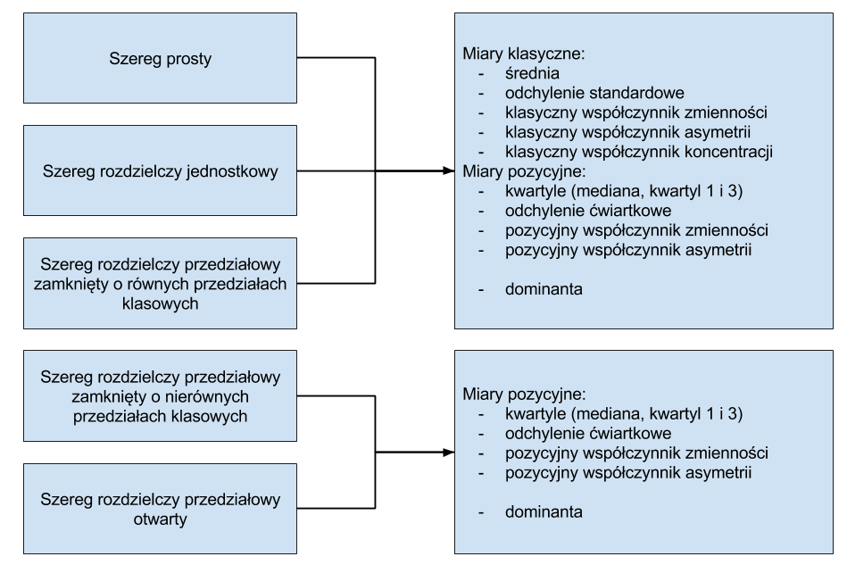

# Analiza struktury

**Kompleksowa analiza struktury** oznacza wyczerpujący opis cech zbiorowości statystycznej. Do charakterystyk najczęściej wykorzystywanych przy opisie struktury zbiorowości należą:

- miary przeciętne - służące do określania tej wartości zmiennej opisanej przez rozkład, wokół której skupiają się pozostałe wartości zmiennej,
- miary rozproszenia (dyspersji) - służące do badania stopnia zróżnicowania wartości zmiennej,
- miary asymetrii - służące do badania asymetrii rozkładu,
- miary koncentracji - służące do analizy stopnia skupienia poszczególnych jednostek wokół średniej.

Analiza struktury bazuje na dwóch typach miar:

- miary klasyczne - obliczane na podstawie wszystkich obserwacji,
- miary pozycyjne - wartość miary wskazuje dana jednostka.

Celem analizy struktury jest dostarczenie kilku liczb, które w łatwy sposób pozwolą na opis i porównania badanych cech.

**Dominanta** czyli najczęściej występująca wartość. Inaczej moda, modalna, tryb (w Excelu - kalka językowa z angielskiego słowa _mode_. Wartość dominanty można ustalić jedynie dla rozkładów jednomodalnych. 

W Excelu jest funkcja:

- WYST.NAJCZĘSĆIEJ,

jednak dla rozkładów wielomodalnych zwróci ona pierwszą modalną.

## Miary klasyczne

Najpopularniejszym przedstawicielem miar klasycznych jest **średnia arytmetyczna**. Wyrażona jest wzorem:

$$\bar{x}=\frac{\sum\limits_{i=1}^{N}{x_{i}}}{N},$$

gdzie: 

- $\bar{x}$ - symbol średniej arytmetycznej, 
- $x_{i}$ - wariant cechy mierzalnej, 
- $N$ - liczebność badanej zbiorowości.

Co sprawia, że średnia jest tak powszechną i uniwersalną miarą? Jest to liczba, która ma najwięcej wspólnego z każdą wartością cechy w zbiorowości. Innymi słowy, odległość wartości cechy od średniej jest najmniejsza z możliwych.

Przykładowo, dane są oceny jednego ze studentów: 3, 4, 5, 3+, 2, 4, 3

```{r srednia, echo=FALSE, fig.height=5, fig.width=8, warning=FALSE, message=FALSE}
library(e1071)

oceny <- data.frame(lp=factor(x=c(1:7)),
                    oceny=c(3,4,5,3.5,2,4,3))

ggplot(oceny, aes(x=lp, y=oceny)) +
  geom_point() +
  geom_hline(yintercept = mean(oceny$oceny), colour = "red") +
  scale_y_continuous(breaks = c(2,2.5,3,3.5,4,4.5,5)) +
  xlab("Numer oceny") + ylab("Ocena") +
  theme_bw()

```

Na powyższym wykresie punkty oznaczają kolejne oceny, natomiast średnia została zaznaczona kolorem czerwonym - wynosi ona 3,5.

Jako miarę odległości poszczególnych ocen od średniej możemy przyjąć wartość bezwzględną różnicy danej oceny i średniej. W tej sytuacji pierwsza ocena różni się od średniej o 0,5, druga ocena także, natomiast trzecia o 1,5, itd. Po zsumowaniu tych wartości otrzymujemy sumę odchyleń równą `r sum(abs(mean(oceny$oceny)-oceny$oceny))`. Jest to najmniejsza wartość jaką jesteśmy w stanie otrzymać. Jeżeli stwierdzimy, że w naszym mniemaniu wartość 3,55 jest lepszą miarą przeciętną to suma odchyleń będzie już większa i wyniesie `r sum(abs(3.55-oceny$oceny))`.

W Excelu istnieje funkcja:

- ŚREDNIA.

Średnia stanowi także dobrą miarę jeśli chcemy porównać jakieś grupy. Co jednak zrobić w sytuacji, kiedy przykładowo dwaj studenci mają identyczne średnie ocen? Czy to oznacza, że ich oceny są także takie same? Taka sytuacja może się zdarzyć, ale występuje dosyć rzadko. Poniżej zostały przedstawione oceny dwóch studentów, którzy mają identyczną średnią.

```{r s2, echo=FALSE, fig.height=5, fig.width=8, warning=FALSE, message=FALSE}
oceny <- data.frame(id=c(rep("Student 1",7), rep("Student 2",7)),
                    lp=factor(x=rep(c(1:7),2)),
                    oceny=c(c(3,4,5,3.5,2,4,3),c(3.5,4,3,3,3.5,4,3.5)))

ggplot(oceny, aes(x=lp, y=oceny)) + 
  geom_point() +
  geom_hline(yintercept = mean(oceny$oceny), colour = "red") +
  facet_wrap(~ id) +
  scale_y_continuous(breaks = c(2,2.5,3,3.5,4,4.5,5)) +
  xlab("Numer oceny") + ylab("Ocena") +
  theme_bw()

n <- 7
var1 <- round(((n-1)/n)*as.numeric(var(subset(oceny, id=="Student 1")["oceny"])),2)
var2 <- round(((n-1)/n)*as.numeric(var(subset(oceny, id=="Student 2")["oceny"])),2)
```

To co możemy zauważyć gołym okiem to fakt, że oceny studenta nr 2 są bliżej średniej. Miarą zróżnicowania cechy jest **wariancja** dana formułą:

$$s^2=\frac{1}{N}\sum\limits_{i=1}^{N}{(x_{i}-\bar{x})^2}$$

gdzie: 

- $s^2$ - symbol wariancji, 
- $\bar{x}$ - średnia arytmetyczna w zbiorowości, 
- $x_{i}$ - wariant cechy mierzalnej,
- $N$ - liczebność badanej zbiorowości.

Jeżeli przeanalizujemy wzór na wariancję jest on bardzo logiczny. W pierwszym kroku liczymy odchylenia wartości cechy od średniej. Następnie otrzymane wartości podnosimy do kwadratu w celu uniknięcia wartości ujemnych, a następnie wszystko uśredniamy. Możemy zatem powiedzieć, że wariancja jest średnią kwadratów odchyleń wartości od średniej. 

Wariancja ocen pierwszego studenta wynosi `r var1`, natomiast drugiego `r var2`. Na podstawie tej miary jesteśmy w stanie stwierdzić, że większe zróżnicowanie ocen występuje u pierwszego studenta. Nie możemy jednak powiedzieć jak bardzo się różnią ponieważ wariancji nie jesteśmy w stanie zinterpretować. Wynika to z faktu, że wynik wariancji jest podawany w jednostkach do kwadratu, co zwykle jest pozbawione sensu. 

W Excelu dysponujemy dwiema funkcjami do wyliczenia wariancji:

- WARIANCJA.POP (we wzorze znajduje się $\frac{1}{N}$),
- WARIANCJA.PRÓBKI (we wzorze znajduje się $\frac{1}{N-1}$).

W zależności od tego czy mamy informację o populacji czy tylko próbie powinniśmy stosować odpowiednią formułę. Podczas zajęć przyjmujemy, że dysponujemy całą populacją i będziemy stosować odpowiednie funkcje.

Pierwiastek z wariancji czyli **odchylenie standardowe** umożliwia liczbowe określenie zróżnicowania. Informuje o ile jednostki zbiorowości różnią się średnio od średniej. W interpretacji odchylenia standardowego musimy pamiętać o pojawiającym się dwa razy słowie _średnia_. Pierwsze dotyczy średniej zastosowanej we wzorze na wariancje, a drugie określa policzoną wcześniej średnią arytmetyczną.

```{r s, echo=FALSE, fig.height=5, fig.width=8, warning=FALSE, message=FALSE}
sd1 <- round(sqrt(var1),2)
sd2 <- round(sqrt(var2),2)
```


O pierwszym studencie powiemy, że jego oceny różnią się średnio od średniej o `r sd1` oceny, natomiast oceny drugiego studenta odchylają się średnio od średniej o `r sd2` oceny. 

Podobnie jak w przypadku wariancji w Excelu znajdują się dwie funkcje do wyznaczania odchylenia standardowego:

- ODCH.STAND.POPUL,
- ODCH.STANDARD.PRÓBKI.

Jeśli średnie są takie same to do oceny zróżnicowania wystarczy odchylenie standardowe. Sytuacja się jednak komplikuje w przypadku występowania różnic pomiędzy średnimi. Jak zatem porównać zróżnicowanie cech, które mają różne średnie i odchylenia standardowe? 

Przeprowadzono eksperyment, w którym 100 osobom zmierzono długość ręki i nogi.

```{r v_s, echo=FALSE, fig.height=5, fig.width=8, warning=FALSE, message=FALSE}
set.seed(100)
n <- 100
rece_nogi <- data.frame(obs=c(rep("Długość ręki",100), rep("Długość nogi",100)),
                    id=rep(c(1:n),2),
                    dl=c(round(rnorm(n, 74.75, 9.19),2),round(rnorm(n, 102.84, 11.66),2))) 

rn_stat <- rece_nogi %>%
  group_by(obs) %>%
  summarize(sr=mean(dl),
            sd=sqrt(((n-1)/n)*var(dl)),
            sk=skewness(dl),
            ku=kurtosis(dl)+3)

rn <- left_join(rece_nogi, rn_stat)

ggplot(rn, aes(x=id, y=dl)) + 
  geom_point() +
  geom_hline(aes(yintercept = sr), colour = "red") +
  facet_wrap(~ obs) +
  xlab("Numer osoby") + ylab("Długość (w cm)") +
  theme_bw()

```

Średnia długość nogi wynosiła `r round(rn_stat$sr[1],2)` cm, a odchylenie standardowe `r round(rn_stat$sd[1],2)` cm. Z kolei długość ręki charakteryzowała się wartością `r round(rn_stat$sr[2],2)` cm z odchyleniem standardowym rzędu `r round(rn_stat$sd[2],2)` cm. Ocena zróżnicowania cech o różnych średnich jest możliwe z wykorzystaniem **klasycznego współczynnika zmienności**:

$$V_{s}=\frac{s}{\bar{x}}\cdot 100,$$

gdzie: 

- $s$ - odchylenie standardowe, 
- $\bar{x}$ - średnia arytmetyczna.

Współczynnik zmienności wyrażony jest w procentach i można przyjąć kilka umownych progów:

- 0%-20% - cecha mało zróżnicowana,
- 21%-40% - cecha umiarkowanie zróżnicowana,
- 41%-60% - cecha silnie zróżnicowana,
- powyżej 60% - cecha bardzo silnie zróżnicowana.

Oczywiście wszystko zależy od tego jaką cechę analizujemy i jakie jest jej typowe zróżnicowanie.

Obliczając wartość współczynnika zmienności dla długości nogi otrzymamy `r round(rn_stat$sd[1]/rn_stat$sr[1]*100,2)`%, natomiast dla długości ręki `r round(rn_stat$sd[2]/rn_stat$sr[2]*100,2)`%. Na tej podstawie możemy stwierdzić, że długość ręki charakteryzuje się większym zróżnicowaniem.

Klasyczny współczynnik zmienności nie ma oprogramowanej odpowiedniej funkcji w Excelu. Można natomiast w prosty sposób tę wartość obliczyć.

Odchylenie standardowe oraz średnią zestawiamy ze sobą także podczas wyznaczania **typowego obszaru zmienności**:

$$\bar{x} - s < x_{typ} < \bar{x} + s$$

Zgodnie z definicją w tym przedziale mieści się około 2/3 wszystkich jednostek analizowanej cechy.

```{r x_typ, echo=FALSE, fig.height=5, fig.width=8, warning=FALSE, message=FALSE}

rn_x_typ <- rn %>%
  filter(obs=="Długość nogi") %>%
  filter(dl > rn_stat$sr[1]-rn_stat$sd[1] & dl < rn_stat$sr[1]+rn_stat$sd[1]) %>%
  count() %>%
  .$n

```

Typowy obszar zmienności dla długości nogi to przedział od `r round(rn_stat$sr[1]-rn_stat$sd[1],2)` cm do `r round(rn_stat$sr[1]+rn_stat$sd[1],2)` cm i w rzeczywistości zawiera `r rn_x_typ/n*100`% obserwacji. 

Patrz też: [Reguła trzech sigm](http://www.naukowiec.org/wiedza/statystyka/regula-trzech-sigm_709.html).

Do kompletnego opisu struktury brakuje tylko miar określających asymetrię oraz skupienie wokół średniej. **Klasyczny współczynnik asymetrii** nazywany także trzecim momentem centralnym albo skośnością jest wyrażony wzorem:

$$\alpha_{3}=\frac{\frac{1}{N}\sum\limits_{i=1}^{N}{(x_{i}-\bar{x})^3}}{s^3},$$

gdzie: 

- $\alpha_{3}$ - symbol klasycznego współczynnika asymetrii,  
- $s$ - odchylenie standardowe w zbiorowości, 
- $\bar{x}$ - średnia arytmetyczna w zbiorowości, 
- $x_{i}$ - wariant cechy mierzalnej, 
- $N$ - liczebność badanej zbiorowości.

Pozwala określić czy rozkład cechy jest:

- symetryczny - rozkład jest symetryczny, $\alpha_{3}=0$,
- lewostronnie asymetryczny - wydłużone lewe ramię rozkładu, $\alpha_{3}<0$,
- prawostronnie asymetryczny - wydłużone prawe ramię rozkładu, $\alpha_{3}>0$. 

Skośność dla długości nogi wynosi `r rn_stat$sk[1]`, co oznacza, że rozkład długości nóg cechuje się lekką prawostronną asymetrią. 

W Excelu znajduje się funkcja o nazwie:

- SKOŚNOŚĆ.

Skupienie wokół średniej definiuje **klasyczny współczynnik koncentracji**, inaczej czwarty moment centralny lub kurtoza:

$$\alpha_{4}=\frac{\frac{1}{N}\sum\limits_{i=1}^{N}{(x_{i}-\bar{x})^4}}{s^4},$$

gdzie: 

- $\alpha_{4}$ - symbol klasycznego współczynnika koncentracji,  
- $s$ - odchylenie standardowe w zbiorowości, 
- $\bar{x}$ - średnia arytmetyczna w zbiorowości, 
- $x_{i}$ - wariant cechy mierzalnej, 
- $N$ - liczebność badanej zbiorowości.

Pozwala określić czy rozkład cechy jest:

- normalny - $\alpha_{4}=3$,
- spłaszczony - wartości nie są mocno skoncentrowane wokół średniej, $\alpha_{4}<3$,
- wysmukły - wartości są mocno skoncentrowane wokół średniej, $\alpha_{4}>3$. 

Niektóre programy zamiast kurtozy wyznaczają tzw. eksces:

$Ex=\alpha_{4}-3$

Wówczas wartość tej miary interpretujemy przyjmując za punkt odniesienia wartość 0.

Kurtoza dla długości nogi wynosi `r rn_stat$ku[1]+3`, co oznacza, że rozkład długości nóg jest wysmukły.

W Excelu znajduje się funkcja o nazwie:

- KURTOZA.

W rzeczywistości wynikiem działania tej funkcji jest eksces. W interpretacji zatem wynik odnosimy do wartości 0.

Do wyznaczenia powyższych miar można także wykorzystać dodatek programu Excel: Analiza danych znajdujący się po prawej stronie we wstążce DANE. Jeśli nie widzimy tego dodatku to klikamy _Przycisk pakietu Office_ w lewym górnym rogu ekranu, następnie _Opcje_. W nowym oknie przechodzimy do _Dodatki_ i na dole okna przycisk _Przejdź_. Zaznaczamy _Analysis ToolPak_ i wybieramy _OK_.

_Przykład_

Wykorzystując zbiór danych na temat sklepów Rossmann przeprowadzimy kompleksową analizę porównawczą struktury sprzedaży w dwóch wybranych sklepach. Pierwszy ze sklepów (id=1) posiada asortyment podstawowy i jest typu _c_, natomiast drugi (id=7) posiada asortyment rozszerzony i jest typu _a_. W pierwszym kroku zobaczmy jak wygląda rozkład analizowanej cechy po wyeliminowaniu dni, w którym sklep był zamknięty.

```{r as-ross-hist, echo=FALSE, fig.height=5, fig.width=8, warning=FALSE, message=FALSE}

rossmann_1_7 <- rossmann200 %>%
  filter(sklep_id %in% c(1,7)) %>%
  filter(czy_otwarty=="Tak")

ggplot(rossmann_1_7, aes(x=sprzedaz)) + 
  geom_histogram(binwidth = 1200) +
  facet_wrap(~ sklep_id) +
  xlab("Sprzedaż") + ylab("Liczebność") +
  theme_bw()

```

Już na pierwszy rzut oka widać różnice w rozkładzie sprzedaży dla poszczególnych sklepów. Pierwszy z rozkładów jest bardziej wysmukły, natomiast w drugim przypadku obserwujemy wyższe wartości sprzedaży. Z wykorzystaniem miar klasycznych dokonamy analizy sprzedaży.

```{r as-ross-miary, echo=FALSE, fig.height=5, fig.width=8, warning=FALSE, message=FALSE}

r_1_7_stat <- rossmann_1_7 %>%
  group_by(sklep_id) %>%
  summarise(n=round(n()),
            x_sr=round(mean(sprzedaz),2),
            s=round(sd(sprzedaz),2),
            v_s=round(s/x_sr*100,2),
            alpha_3=round(skewness(sprzedaz),2),
            alpha_4=round(kurtosis(sprzedaz)+3,2))

r_1_7_stat_t <- t(r_1_7_stat)[-1,]

colnames(r_1_7_stat_t) <- c("Sklep_1", "Sklep_7")

knitr::kable(r_1_7_stat_t)

```

## Miary pozycyjne

Podstawowe miary pozycyjne nie są obliczane z wykorzystaniem wszystkich obserwacji, jak ma to miejsce w przypadku miar klasycznych, tylko szukamy obserwacji która wskazuje wartość wybranej miary pozycyjnej. Najpopularniejszą z miar pozycyjnych jest **mediana** (kwartyl 2, wartość środkowa, $Q_2$), która wyznacza wartość dla której 50% jednostek zbiorowości ma wartości cechy niższe bądź równe medianie, a 50% równe bądź wyższe od mediany.

Medianę wyznacza się poprzez posortowanie wartości cechy rosnąco i wybór wartości środkowej (jeśli $N$ jest nieparzyste) lub średniej z wartości środkowych (jeśli $N$ jest parzyste).

Zaletą mediany jest mniejsza wrażliwość na obserwacje odstające. Rozważmy przypadek wynagrodzeń w pewnych przedsiębiorstwach:

```{r mediana, echo=FALSE, fig.height=5, fig.width=8, warning=FALSE, message=FALSE}

wynagrodzenia <- data.frame(id=c(rep("Firma A",14), rep("Firma B",14)),
                    lp=factor(x=rep(c(1:14),2)),
                    wyn=c(c(2000,2100,2400,2500,2700,2900,3500,3500,3800,3850,4100,4250,4400,5000),
                          c(2000,2100,2100,2200,2350,2400,2500,2550,2700,2700,4900,4950,5000,5000)))

wyn_stat <- wynagrodzenia %>%
  group_by(id) %>%
  summarise(srednia=round(mean(wyn)),
            mediana=round(median(wyn)),
            min=round(min(wyn)),
            q1=round(quantile(wyn, 0.25)),
            q3=round(quantile(wyn, 0.75)),
            max=round(max(wyn))) %>%
  mutate(q=round((q3-q1)/2),
         vq=round(q/mediana*100),
         aq=round((q1+q3-2*mediana)/(2*q),2))

wyn_stat$id <- factor(wyn_stat$id, levels = rev(unique(wyn_stat$id)), ordered = T)

wynagrodzenia <- left_join(wynagrodzenia, wyn_stat)

ggplot(wynagrodzenia, aes(x=lp, y=wyn)) + 
  geom_point() +
  facet_wrap(~ id) +
  geom_hline(aes(yintercept = srednia), colour = "red") +
  geom_hline(aes(yintercept = mediana), colour = "blue") +
  xlab("Numer pracownika") + ylab("Wynagrodzenie") +
  theme_bw()

```

W firmie A wynagrodzenia pracowników nie są zróżnicowane, ale nie występują pomiędzy nimi zbyt duże różnice. Średnia pensja (kolor czerwony) wynosi `r wyn_stat$srednia[1]` zł, natomiast mediana (kolor niebieski) odpowiada wynagrodzeniom 7 i 8 pracownika - `r wyn_stat$mediana[1]` zł. Można powiedzieć, że obie wartości dobrze odzwierciedlają realne zarobki pracowników. Z kolei w firmie B nierówności dochodowe są znacznie większe, możliwe że zestawiono wynagrodzenia pracowników szeregowych oraz kadry zarządzającej. Średnia wynosząca `r wyn_stat$srednia[2]` zł nie oddaje prawdziwych zarobków ani pierwszej ani drugiej grupy. Natomiast wartość mediany wynosząca `r wyn_stat$mediana[2]` zł jest bardziej odporna na wartości odstające. Mediana wynagrodzenia w firmie B oznacza, że 50% pracowników otrzymuje pensję w wysokości `r wyn_stat$mediana[2]` zł lub mniej, natomiast drugie 50% zatrudnionych uzyskuje wynagrodzenie w wysokości `r wyn_stat$mediana[2]` zł lub więcej.

W Excelu możemy skorzystać z funkcji:

- MEDIANA(wartości cechy),
- KWARTYL.PRZEDZ.ZAMK(wartości cechy, 2).

Mediana podzieliła nam jednostki zbiorowości na dwie połowy. Jeśli podzielimy pierwszą połową ponownie na pół otrzymamy wartość **kwartyla pierwszego (dolnego)**, który informuje, że 25% jednostek zbiorowości ma wartości cechy niższe bądź równe kwartylowi pierwszemu $Q_{1}$, a 75\% równe bądź wyższe od tego kwartyla. Z kolei po podzieleniu drugiej połowy obserwacji uzyskujemy wartość **kwartyla trzeciego (górnego)**, który informuje, że 75\% jednostek zbiorowości ma wartości cechy niższe bądź równe kwartylowi trzeciemu $Q_{3}$, a 25\% równe bądź wyższe od tego kwartyla.

Do wyznaczenia wartości kwartyli w Excelu korzystamy z funkcji:

- KWARTYL.PRZEDZ.ZAMK(wartości cechy, numer kwartyla),

gdzie numer kwartyla to:

- 0 - minimum,
- 1 - kwartyl dolny,
- 2 - mediana,
- 3 - kwartyl górny,
- 4 - maksimum.

W firmie A kwartyl dolny wynagrodzeń wyniósł `r wyn_stat$q1[1]` zł, co oznacza, że 25% pracowników uzyskuje pensją równą bądź niższą niż `r wyn_stat$q1[1]` zł, a 75% równą bądź wyższą niż `r wyn_stat$q1[1]`. Z kolei 75% pracowników otrzymuje wynagrodzenie mniejsze lub równe `r wyn_stat$q3[1]` zł, a 25% większe bądź równe `r wyn_stat$q3[1]` zł. W firmie B kwartyl pierwszy jest równy `r wyn_stat$q1[2]` zł, a trzeci `r wyn_stat$q3[2]` zł.

Wartości kwartyli można przedstawić na wykresie pudełkowym (ang. boxplot):

```{r boxplot, echo=FALSE, fig.height=5, fig.width=8, warning=FALSE, message=FALSE}

ggplot(wyn_stat, aes(x = id, ymin = min, lower = q1, middle = mediana, upper = q3, ymax = max)) +
  geom_boxplot(stat = "identity") +
  coord_flip() +
  xlab("") + ylab("Wynagrodzenie") +
  theme_bw()

```

W miarach pozycyjnych opartych na kwartylach zróżnicowanie wartości od mediany mierzy **odchylenie ćwiartkowe**:

$$Q=\frac{(Q_{3}-Q_{1})}{2}$$

gdzie:

- $Q$ - symbol odchylenia ćwiartkowego, 
- $Q_{1}$ - kwartyl pierwszy, 
- $Q_{3}$ - kwartyl trzeci.

Mierzy ono przeciętne odchylenie wartości cechy zbiorowości od mediany u 50% środkowych jednostek - między kwartylem dolnym i górnym. Przykładowo w firmie A przeciętne odchylenie wynagrodzenia od mediany wynosi `r wyn_stat$q[1]` zł.

Zestawienie ochylenia ćwiartkowego oraz mediany pozwala na obliczenie **pozycyjnego współczynnika zmienności**:

$$V_{Q}=\frac{Q}{Q_2} \cdot 100$$

gdzie: 

- $V_{Q}$ - symbol pozycyjnego współczynnika zmienności, 
- $Q$ - odchylenie ćwiartkowe, 
- $Q_2$ - mediana.

Podobnie jak w przypadku klasycznego współczynnika zmienności korzystamy z umownych progów dotyczących zróżnicowania. W firmie A pozycyjny współczynnik zmienności był równy `r wyn_stat$vq[1]`% co oznacza, że wynagrodzenia w tej firmie cechowały się umiarkowanym zróżnicowaniem, natomiast w firmie B było to `r wyn_stat$vq[2]`% czyli silne zróżnicowanie wynagrodzeń.

Ostatnią miarą opartą na kwartylach jest **pozycyjny współczynnik asymetrii**, który określa kierunek i siłę asymetrii jednostek znajdujących się między pierwszym i trzecim kwartylem:

$$A_{Q}=\frac{(Q_{1}+Q_{3}-2 \cdot Q_2)}{(2 \cdot Q)}$$

gdzie: 

- $A_{Q}$ --- symbol pozycyjnego współczynnika asymetrii, 
- $Q_{1}$ --- kwartyl pierwszy, 
- $Q_{3}$ --- kwartyl trzeci, 
- $Q_{2}$ --- mediana, 
- $Q$ --- odchylenie ćwiartkowe.

Interpretacja pozycyjnego współczynnika asymetrii przebiega identycznie jak w przypadku klasycznego współczynnika asymetrii:

- symetryczny - mediana pomiędzy wartościami kwartyli dolnego i górnego, $A_{Q}=0$,
- lewostronnie asymetryczny - mediana bliżej wartości kwartyla górnego, $A_{Q}<0$,
- prawostronnie asymetryczny - mediana bliżej wartości kwartyla dolnego, $A_{Q}>0$.

Tę informację możemy także odczytać z wykresu pudełkowego, określając umiejscowienie mediany względem pozostałych kwartyli:

```{r asymetria, echo=FALSE, fig.height=5, fig.width=8, warning=FALSE, message=FALSE}

as <- c("Brak asymetrii", "Asymetria \nlewostronna", "Asymetria \nprawostronna")
box_sym <- data.frame(x = factor(x = as, levels = rev(as),  ordered = T),
                      min=c(0,0,0),
                      q1=c(15,10,15),
                      q2=c(40,45,35),
                      q3=c(65,65,70),
                      max=c(80,80,80))


ggplot(box_sym, aes(x = x, ymin = min, lower = q1, middle = q2, upper = q3, ymax = max)) +
  geom_boxplot(stat = "identity") +
  coord_flip() +
  xlab("") + ylab("") +
  theme_bw()

```

W firmie A pozycyjny współczynnik asymetrii był równy `r wyn_stat$aq[1]`, co pociąga za sobą informację o asymetrii lewostronnej, natomiast w firmie B występowała asymetria prawostronna (`r wyn_stat$aq[2]`). 

_Przykład_

Wyznaczmy miary pozycyjne dla dwóch sklepów Rossmann analizowanych wcześciej:

```{r as-ross-miary-poz, echo=FALSE, fig.height=5, fig.width=8, warning=FALSE, message=FALSE}

r_1_7_stat_p <- rossmann_1_7 %>%
  group_by(sklep_id) %>%
  summarise(n=round(n()),
            q1=round(quantile(sprzedaz,0.25)),
            q2=round(quantile(sprzedaz,0.5)),
            q3=round(quantile(sprzedaz,0.75)),
            q=round((q3-q1)/2,2),
            v_q=round(q/q2*100,2),
            aq=round((q1+q3-2*q2)/(2*q),2))

r_1_7_stat_p_t <- t(r_1_7_stat_p)[-1,]

colnames(r_1_7_stat_p_t) <- c("Sklep_1", "Sklep_7")

knitr::kable(r_1_7_stat_p_t)

```

_Zadania_

Przeprowadzić kompleksową analizę struktury sprzedaży/liczby klientów dla poszczególnych dni tygodnia.

```{r as-ross-sprzed, echo=FALSE, fig.height=5, fig.width=8, warning=FALSE, message=FALSE}

sprzedaz_stat <- rossmann200 %>%
  filter(czy_otwarty=="Tak") %>%
  group_by(dzien_tyg) %>%
  summarise(n=round(n()),
            x_sr=round(mean(sprzedaz),2),
            s=round(sd(sprzedaz),2),
            v_s=round(s/x_sr*100,2),
            alpha_3=round(skewness(sprzedaz),2),
            alpha_4=round(kurtosis(sprzedaz)+3,2))

sprzedaz_stat_t <- t(sprzedaz_stat)

```

```{r as-ross-klienci, echo=FALSE, fig.height=5, fig.width=8, warning=FALSE, message=FALSE}

klienci_stat <- rossmann200 %>%
  filter(czy_otwarty=="Tak") %>%
  group_by(dzien_tyg) %>%
  summarise(n=round(n()),
            x_sr=round(mean(liczba_klientow),2),
            s=round(sd(liczba_klientow),2),
            v_s=round(s/x_sr*100,2),
            alpha_3=round(skewness(liczba_klientow),2),
            alpha_4=round(kurtosis(liczba_klientow)+3,2))

klienci_stat <- t(klienci_stat)

```

## Szereg jednostkowy i przedziałowy

Nie zawsze dysponujemy danymi zebranymi w szeregu prostym. W opracowaniach statystycznych dane publikowane są w postaci szeregów jednostkowych oraz przedziałowych. W tej części opracowania skupimy się na analizie struktury takich danych.

### Szereg jednostkowy

W przypadku szeregu jednostkowego możliwe jest odtworzenie szeregu prostego bądź zastosowanie wzorów, w których odpowiednio przeważymy obserwacje. Odpowiednimi wagami będą liczebności.

$$\bar{x}=\frac{1}{N}\sum\limits_{i=1}^{N}{x_{i}n_{i}}$$

$$s^2=\frac{1}{N}\sum\limits_{i=1}^{N}{(x_{i}-\bar{x})^2 \cdot n_{i}}$$

$$\alpha_{3}=\frac{\frac{1}{N}\sum\limits_{i=1}^{N}{(x_{i}-\bar{x})^3}\cdot n_{i}}{s^3}$$

$$\alpha_{4}=\frac{\frac{1}{N}\sum\limits_{i=1}^{N}{(x_{i}-\bar{x})^4 \cdot n_{i}}}{s^4}$$

gdzie:

- $\bar{x}$ - średnia arytmetyczna w zbiorowości, 
- $s$ - odchylenie standardowe w zbiorowości, 
- $\alpha_{3}$ - symbol klasycznego współczynnika asymetrii,  
- $\alpha_{4}$ - symbol klasycznego współczynnika koncentracji,  
- $x_{i}$ - wariant cechy mierzalnej, 
- $n_{i}$ - liczba obserwacji dla wariantu, 
- $N$ - liczebność badanej zbiorowości.

### Szereg przedziałowy

W przypadku szeregu przedziałowego przeprowadzanie analizy struktury nie jest już takie oczywiste. Nie mamy jednoznacznie określonego wariantu cechy. W związku z tym wyznaczamy środek przedziału klasowego i tą wartość traktujemy jako wariant cechy. Z takiego podejścia do sprawy wynikają dwie istotne kwestie:

- poniższe wzory możemy zastosować wyłącznie do analizy szeregów rozdzielczych przedziałowych zamkniętych o równych przedziałach klasowych,
- sposób utworzenia szeregu rozdzielczego będzie miał wpływ na precyzję wyników. 

$$\bar{x}=\frac{1}{N}\sum\limits_{i=1}^{N}{x_{i}'n_{i}}$$

$$s^2=\frac{1}{N}\sum\limits_{i=1}^{N}{(x_{i}'-\bar{x})^2 \cdot n_{i}}$$

$$\alpha_{3}=\frac{\frac{1}{N}\sum\limits_{i=1}^{N}{(x_{i}'-\bar{x})^3}\cdot n_{i}}{s^3}$$

$$\alpha_{4}=\frac{\frac{1}{N}\sum\limits_{i=1}^{N}{(x_{i}'-\bar{x})^4 \cdot n_{i}}}{s^4}$$

gdzie:

- $\bar{x}$ - średnia arytmetyczna w zbiorowości, 
- $s$ - odchylenie standardowe w zbiorowości, 
- $\alpha_{3}$ - symbol klasycznego współczynnika asymetrii,  
- $\alpha_{4}$ - symbol klasycznego współczynnika koncentracji,  
- $x_{i}'$ - środek przedziału klasowego dla wariantu cechy, 
- $n_{i}$ - liczba obserwacji dla wariantu, 
- $N$ - liczebność badanej zbiorowości.

Przy założeniu, że dominanta znajduje się w najliczniejszym przedziale możemy zastosować poniższy wzór:

$$D=x_{D}+\frac{n_{D}-n_{D-1}}{2n_{D}-n_{D-1}-n_{D+1}}\cdot c_{D}$$

gdzie:

- $D$ - symbol dominanty, 
- $x_{D}$ - początek przedziału, w którym znajduje się dominanta, 
- $n_{D}$ - liczebność najliczniejszego przedziału, 
- $n_{D-1}$ - liczebność przedziału wcześniejszego niż najliczniejszy, 
- $n_{D+1}$ - liczebność przedziału późniejszego niż najliczniejszy, 
- $c_{D}$ - rozpiętość najliczniejszego przedziału.

Dla szeregu rozdzielczego możemy także wyznaczyć wartości kwartyli stosując wzory interpolacyjne:

$$Q_{1}=xQ_{1}+\frac{\frac{N}{4}-cumQ_{1}^{-1}}{nQ_{1}} \cdot cQ_{1}$$

gdzie:

- $Q_{1}$ - oznaczenie kwartyla pierwszego, 
- $N$ - liczebność badanej zbiorowości, 
- $xQ_{1}$ - początek przedziału, w którym znajduje się kwartyl pierwszy, 
- $cumQ_{1}^{-1}$ - skumulowana liczebność z przedziału wcześniejszego niż ten, który zawiera kwartyl pierwszy,
- $nQ_{1}$ - liczebność przedziału zawierającego kwartyl pierwszy, 
- $cQ_{1}$ - rozpiętość przedziału zawierającego kwartyl pierwszy.

$$Q_{2}=xQ_{2}+\frac{\frac{N}{2}-cumQ_{2}^{-1}}{nQ_{2}} \cdot cQ_{2}$$

gdzie: 

- $Q_{2}$ - oznaczenie mediany, 
- $N$ - liczebność badanej zbiorowości, 
- $xQ_{2}$ - początek przedziału, w którym znajduje się mediana, 
- $cumQ_{2}^{-1}$ - skumulowana liczebność z przedziału wcześniejszego niż ten, który zawiera mediana, 
- $nQ_{2}$ - liczebność przedziału zawierającego medianę, 
- $cQ_{2}$ - rozpiętość przedziału zawierającego medianę.

$$Q_{3}=xQ_{3}+\frac{\frac{3N}{4}-cumQ_{3}^{-1}}{nQ_{3}} \cdot cQ_{3}$$

gdzie:

- $Q_{3}$ - oznaczenie kwartyla trzeciego, 
- $N$ - liczebność badanej zbiorowości, 
- $xQ_{3}$ - początek przedziału, w którym znajduje się kwartyl trzeci, 
- $cumQ_{3}^{-1}$ - skumulowana liczebność z przedziału wcześniejszego niż ten, który zawiera kwartyl trzeci,
- $nQ_{3}$ - liczebność przedziału zawierającego kwartyl trzeci, 
- $cQ_{3}$ - rozpiętość przedziału zawierającego kwartyl trzeci.

Po wyznaczeniu wartości kwartyli pozostałe miary liczymy w tradycyjny sposób.


## Podsumowanie miar

### Schemat



### Miary klasyczne

| Miara                |Oznaczenie | Wzór                | Interpretacja i wykorzystanie    | Funkcja w Excelu |
|----------------------|-----------|--------------------------------|--------------------|--------------------|
| Średnia arytmetyczna |$\bar{x}$  | $\frac{\sum_{i=1}^N x_i}{N}$   | Wartość przeciętna | `ŚREDNIA(x)`       |
| Średnia harmoniczna  |$\bar{x}_h$| $\frac{n}{\sum_{i=1}^N\frac{1}{x_i}}$ | Wartość przeciętna | `ŚREDNIA.GEOMETRYCZNA(x)` |
| Średnia geometryczna |$\bar{x}_g$| $\sqrt{x_1 x_2 ... x_N}$ | Wartość przeciętna | `ŚREDNIA.HARMONICZNA(x)`  |
| Odchylenie przeciętne (średnie)  |  $d$  | $\frac{1}{N}\sum \mid x_i - \bar{x} \mid$ | O ile wszystkie jednostki badanej zbiorowości różnią się średnio ze względu na wartość zmiennej od średniej arytmetycznej tej zmiennej | `ODCH.ŚREDNIE(x)`  |
| Odchylenie kwadratowe |  $d^2$ | $\sum_{i=1}^N (x_i - \bar{x})^2$ | Kwadrat odchylenia przeciętnego | `ODCH.KWADRATOWE(x)` |
| Odchylenie standardowe (dla populacji) | $s$ | $\sqrt{\frac{\sum_{i=1}^N (x_i - \bar{x})^2}{N}}$ | O ile przeciętnie odchylają się wartości od średniej  | `ODCH.STAND.POPUL(x)`  |
| Odchylenie standardowe (dla próby) | $s$ | $\sqrt{\frac{\sum_{i=1}^N (x_i - \bar{x})^2}{N-1}}$ | O ile przeciętnie odchylają się wartości od średniej  | `ODCH.STANDARD.PRÓBKI(x)`  |
| Wariancja (dla populacji) | $s^2$ | $\frac{\sum_{i=1}^N (x_i - \bar{x})^2}{N}$ | Informuje o zróżnicowaniu populacji | `WARIANCJA.POP(x)`  |
| Wariancja (dla próby) | $s^2$ | $\frac{\sum_{i=1}^N (x_i - \bar{x})^2}{N-1}$ | Informuje o zróżnicowaniu próby | `WARIANCJA.PRÓBKI(x)`  |
| Rozstęp | $R$ | $max(x) - min(x)$ | Empiryczny obszar zmienności, wartość maksymalna cechy x minus wartość minimalna tej cechy  | --  |
| Typowy obszar zmiennośći |-- | $\bar{x} - s < x_{typ} < \bar{x} + s$ | Informuje o relatywnym zróżnicowaniu populacji (próby). Zwykle wykorzystujemy do porównań dwóch lub więcej grup.  | --  |
| Współczynnik zmienności | $V_x$ | $\frac{s}{\bar{x}}$ | Informuje o relatywnym zróżnicowaniu populacji (próby). Zwykle wykorzystujemy do porównań dwóch lub więcej grup. Wyrażamy w procentach.  | --  |
| Współczynnik asymetrii | $\alpha_3$ | $\frac{\frac{1}{N}\sum_{i=1}^{N}{(x_{i}-\bar{x})^3}}{s^3}$ | Pozwala zidentyfikować czy rozkład jest symetryczny lub asymetryczny | `SKOŚNOŚĆ(x)`  |
| Współczynnik koncentracji | $\alpha_4$ | $\frac{\frac{1}{N}\sum_{i=1}^{N}{(x_{i}-\bar{x})^4}}{s^4}$ | Pozwala zidentyfikować czy rozkład jest wysmukły czy spłaszczony | `KURTOZA(x)`  |
| Eksces | $Ex$ | $\alpha_4-3$ | Pozwala zidentyfikować czy rozkład jest wysmukły czy spłaszczony (porównujemy do 0) | --  |


### Miary pozycyjne

| Miara                |Oznaczenie | Wzór                | Interpretacja i wykorzystanie    | Funkcja w Excelu |
|----------------------|-----------|--------------------------------|--------------------|--------------------|
| Kwartyl 1 |$Q_1$  |  | Dzieli populację na dwie części w stosunku 25 / 75 | `KWARTYL.PRZEDZ.ZAMK(x,1)`   |
| Kwartyl 2, Mediana |$Q_2, Me$  |  | Dzieli populację na dwie części w stosunku 50 / 50 | `KWARTYL.PRZEDZ.ZAMK(,2)` lub `MEDIANA(x)`   |
| Kwartyl 3 |$Q_3$  |  | Dzieli populację na dwie części w stosunku 75 / 25 | `KWARTYL.PRZEDZ.ZAMK(x,3)`   |
| Odchylenie ćwiartkowe |$Q$  | $Q=\frac{Q3-Q1}{2}$   | Mierzy ono przeciętne odchylenie wartości cechy zbiorowości od mediany | -- |
| Pozycyjny współczynnik zmienności |$V_Q$  | $\frac{Q}{Me}$   | Mierzy przeciętne zróżnicowanie cechy | -- |
| Pozycyjny współczynnik asymetrii |$A_Q$  | $\frac{Q_1+Q3-2Me}{2Q}$   | Mierzy (a)symetrię rozkładu | -- |

## Przedziały ufności

Dotyczas analizowane dane dotyczyły populacji, zatem obliczone wartości statystyk można uznać za precyzyjne i nieobciążone błędem. Natomiast większość prowadzonych badań ogranicza się do analizy jedynie fragmentu populacji. Wówczas, oprócz obliczenia interesującej nas miary ważne jest także podanie możliwego błędu. Popularną praktyką jest obliczanie **przedziałów ufności**, które prezentują zakres, w którym z określonym prawdopodobieństwem znajduje się prawdziwa wartość parametru. Zwykle bierze się pod uwagę następujące prawdopodobieństwa: 90%, 95% i 99%, niemniej można wybrać dowolną wartość z przedziału 0-100%. We wzorach operuje się pojeciem **poziomu istotności** oznaczanym przez $\alpha$. 

Skupimy się na wyznaczaniu następujących przedziałów ufności:

- dla średniej w populacji normalnym ze znanym odchyleniem standardowym,
- dla średniej w populacji normalnym z nieznanym odchyleniem standardowym dla małej próby,
- dla średniej w populacji normalnym z nieznanym odchyleniem standardowym dla dużej próby,
- dla odsetka (proporcji, frakcji).

W każdym przypadku będziemy musieli wyznaczyć kwantyl rozkładu, który odpowiada przyjętemu poziomowi prawdopodobieństwa i tym samym obszar, który pokryje wyznaczony przedział ufności. Dla rozkładu normalnego ta sytuacja jest przedstawiona na wykresie:

```{r}
ggplot(NULL, aes(c(-3,3))) +
  geom_area(stat = "function", fun = dnorm, fill = "#E94246", xlim = c(-3, -1.96)) +
  geom_area(stat = "function", fun = dnorm, fill = "#466AAD", xlim = c(-1.96, 1.96)) +
  geom_area(stat = "function", fun = dnorm, fill = "#E94246", xlim = c(1.96, 3)) +
  geom_vline(xintercept = 0, color = "#034e7b", size = 1.5) +
  annotate("text", x = 0.3, y = 0.43, label = "średnia") +
  labs(x = "", y = "") +
  scale_y_continuous(breaks = NULL) +
  scale_x_continuous(breaks = c(-1.96, 1.96), labels = c(expression(paste(-z(1-alpha/2),)), expression(paste(z(1-alpha/2),)))) +
  theme_light() +
  # annotate("text", x = -2.6, y = 0.3, label = "obszar \nodrzucenia H0") +
  # annotate("text", x = 2.6, y = 0.3, label = "obszar \nodrzucenia H0") + 
  ggtitle("Rozkład normalny")

```

W tabeli przedstawiono relację przyjętego prawdopodobieństwa, poziomu istotności oraz wartości kwantyli rozkładu normalnego.

| Prawdopodobieństwo | Poziom istotności | Kwantyl rozkł. norm.|
|-------------------:|------------------:|--------------------:|
| 99% (0,99) | 0,01 | 2,58 | 
| 95% (0,95) | 0,05 | 1,96 |
| 90% (0,90) | 0,10 | 1,64 |

W Excelu te wartości można wyznaczyć z wykorzystaniem funkcji: ROZKŁ.NORMALNY.S.ODWR(1-$\alpha$/2).

Te wartości dla najpopularniejszych poziomów prawdopodobieństwa zawsze będą takie same. Natomiast w przypadku małych prób ($n < 30$) należy skorzystać z rozkładu [t-Studenta](https://pl.wikipedia.org/wiki/William_Sealy_Gosset). Kształt tego rozkładu jest zbliżony do normalnego, natomiast wartości kwantyli zależą od dwóch parametrów - przyjętego poziomu istotności oraz liczebności próby pomniejszonej o 1 (liczba stopni swobody).

```{r}
ggplot(NULL, aes(c(-3,3))) +
  geom_area(stat = "function", fun = dt, fill = "#E94246", xlim = c(-3, -2.12), args = list(df = 16)) +
  geom_area(stat = "function", fun = dt, fill = "#466AAD", xlim = c(-2.12, 2.12), args = list(df = 16)) +
  geom_area(stat = "function", fun = dt, fill = "#E94246", xlim = c(2.12, 3), args = list(df = 16)) +
  geom_vline(xintercept = 0, color = "#034e7b", size = 1.5) +
  annotate("text", x = 0.3, y = 0.43, label = "średnia") +
  labs(x = "", y = "") +
  scale_y_continuous(breaks = NULL) +
  scale_x_continuous(breaks = c(-2.12, 2.12), labels = c(expression(paste(-t(1-alpha/2, n-1),)), expression(paste(t(1-alpha/2, n-1),)))) +
  theme_light() +
  # annotate("text", x = -2.6, y = 0.3, label = "obszar \nodrzucenia H0") +
  # annotate("text", x = 2.6, y = 0.3, label = "obszar \nodrzucenia H0") + 
  ggtitle("Rozkład t-Studenta z 16 stopniami swobody")
```

Do wyznaczenia wartości kwantyla z rozkładu t-Studenta wykorzystuje się funkcje: ROZKŁ.T.ODWR(1-$\alpha$/2;$n$-1) lub ROZKŁ.T.ODWR.DS($\alpha$;$n$-1)

### Średnia w populacji normalnej ze znanym odchyleniem standardowym

W sytuacji, w której znane jest odchylenie standardowe w populacji np. z wcześniejszych badań można wykorzystać następujący wzór:

$$P\left\{\bar{X}-z_{(1-\alpha/2)}\frac{\sigma}{\sqrt{n}}<m<\bar{X}+z_{(1-\alpha/2)}\frac{\sigma}{\sqrt{n}}\right\}=1-\alpha$$
gdzie:

- $m$ - prawdziwa wartość średniej w populacji,
- $\bar{X}$ - estymator średniej,
- $z_{(1-\alpha/2)}$ - kwantyl rozkładu normalnego obliczony dla poziomu istotności $\alpha$,
- $\sigma$ - znane odchylenie standardowe,
- $n$ - liczebność próby.

**Przykład**

W zakładzie produkcyjnym postanowiono zbadać staż pracy pracowników. W tym celu z populacji pracowników wylosowano próbę o liczebności 196 osób, na podstawie której obliczono, że $\bar{x}=6,9$ lat. Dotychczasowe doświadczenie wskazuje, że rozkład stażu pracowników jest opisany rozkładem normalnym z odchyleniem standardowym 2,8 lat. Dla $\alpha=0,05$ zbudować przedział ufności.

Kwantyl rozkładu normalnego można obliczyć z wykorzystaniem formuły `ROZKŁ.NORMALNY.S.ODWR`. W tym przypadku zostanie użyta formuła `ROZKŁ.NORMALNY.S.ODWR(1-0,05/2)`, co skutkuje otrzymaniem wartości 1,96. Po podstawieniu do wzoru:

$$6,9-1,96\frac{2,8}{\sqrt{196}} < m < 6,9+1,96\frac{2,8}{\sqrt{196}}$$

$$6,508 < m < 7,292$$

Przedział od 6,5 do 7,3 lat z prawdopodobieństwem 95% pokrywa prawdziwą wartość stażu pracy wszystkich pracowników.

### Średnia w populacji normalnej z nieznanym odchyleniem standardowym - mała próba

Jeśli odchylenie standardowe w populacji nie jest znane to można wykorzystać wzór, w którym używa się wartości odchylenia standardowego obliczonego na podstawie próbie. Trzeba jednak rozróżnić małą oraz dużą próbę. Przyjętym w statystyce progiem jest $n > 30$, kiedy uznaje się próbę za dużą. Podstawową różnicą jest wykorzystanie we wzorze przedziału ufności dla małej próby kwantyla rozkładu t-Studenta, a dla dużej kwantyla rozkładu normalnego. 

$$P\left\{\bar{X}-t_{(1-\alpha/2,n-1)}\frac{s}{\sqrt{n-1}}<m<\bar{X}+t_{(1-\alpha/2,n-1)}\frac{s}{\sqrt{n-1}}\right\}=1-\alpha$$

gdzie:

- $m$ - prawdziwa wartość średniej w populacji,
- $\bar{X}$ - estymator średniej,
- $t_{(1-\alpha/2,n-1)}$ - kwantyl rozkładu t-Studenta dla poziomu istotności $\alpha$ z $n-1$ stopniami swobody,
-	$s$ - odchylenie standardowe z próby, 
-	$n$ - liczebność próby.

**Przykład**

Postanowiono oszacować średni czas potrzebny do wykonania detalu. Z populacji robotników wylosowano próbę 17 osób i dokonano pomiaru czasu wykonywania detalu. Okazało się, że średni czas wykonania detalu wynosił 15 minut, a odchylenie standardowe 2 minuty. Rozkład czasu wykonania tego detalu ma rozkład normalny i przyjęto poziom istotności $\alpha=0,05$.

Wartość kwantyla rozkładu t-Studenta obliczamy za pomocą formuły `ROZKŁ.T.ODWR(1-0,05/2;16)` lub `ROZKŁ.T.ODWR.DS(0,05;16)`, co daje wartość 2,12.

$$15-2,12\frac{2}{\sqrt{16}}<m<15+2,12\frac{2}{\sqrt{16}}$$

$$13,94 < m < 16,06$$

Średni czas wykonania detalu z 95\% prawdopodobieństwem jest nie mniejszy niż 13,94 i nie większy niż 16,06 minuty.

### Średnia w populacji normalnej z nieznanym odchyleniem standardowym - duża próba

W przypadku dużej próby przedział ufności można przybliżyć z wykorzystaniem kwantyla rozkładu normalnego.

$$P\left\{\bar{X}-z_{(1-\alpha/2)}\frac{s}{\sqrt{n}}<m<\bar{X}+z_{(1-\alpha/2)}\frac{s}{\sqrt{n}}\right\} \approx 1-\alpha$$

gdzie:

- $m$ - prawdziwa wartość średniej w populacji,
- $\bar{X}$ - estymator średniej,
- $z_{(1-\alpha/2)}$ - kwantyl rozkładu normalnego obliczony dla poziomu istotności $\alpha$,
- $s$ - odchylenie standardowe z próby,
- $n$ - liczebność próby.

### Proporcja

Na podobnej zasadzie można także wyznaczyć przdział ufności dla odsetka.

$$	P\left\{\frac{m}{n}-z_{(1-\alpha/2)}\sqrt{\frac{\frac{m}{n}\left(1-\frac{m}{n}\right)}{n}}<p<\frac{m}{n}+z_{(1-\alpha/2)}\sqrt{\frac{\frac{m}{n}\left(1-\frac{m}{n}\right)}{n}}\right\} \approx 1-\alpha$$

gdzie:

- $p$ - wartość proporcji w populacji,
-	$z_{(1-\alpha/2)}$ - kwantyl rozkładu normalnego obliczony dla poziomu istotności $\alpha$,
-	$m$ - liczba jednostek posiadających daną cechę,
-	$n$ - liczebność 

**Przykład**

Spośród 10 tysięcy pracowników wylosowano próbę liczącą 200 osób i przeprowadzono badanie dotyczące opuszczenia zakładu pracy. Okazało się, że 20 z 200 respondentów zamierza, z różnych względów, opuścić zakład pracy. Dla poziomu ufności 90% wyznaczyć przedział ufności dla wskaźnika pracowników planujących opuścić bieżące miejsce pracy.

$$\frac{20}{200}-1,64\sqrt{\frac{\frac{20}{200}\left(1-\frac{20}{200}\right)}{200}} < p < \frac{20}{200}+1,64\sqrt{\frac{\frac{20}{200}\left(1-\frac{20}{200}\right)}{200}}$$
$$0,065 < p < 0,135$$

$$6,5\% < p < 13,5\%$$

Z prawdopodobieństwem 90% możemy stwierdzić, że pracowników planujących opuścić zakład pracy jest nie mniej niż 6,5% i nie więcej niż 13,5%.

## Testy statystyczne

Test statystyczna to procedura pozwalająca oszacować prawdopodobieństwo spełnienia pewnej hipotezy statystycznej w populacji na podstawie danych pochodzących z próby losowej. Hipoteza statystyczna to układ dwóch hipotez: zerowej i alternatywnej.

- hipoteza zerowa $H_0$ - zakładamy, że pomiędzy estymatorem i parametrem lub rozkładem empirycznym i teoretycznym nie ma różnic ($H_0$ zawsze zawiera znak równości):

$$H_0: m=m_0$$
- hipoteza alternatywna $H_1$ - dopuszcza istnienie różnic pomiędzy estymatorem a parametrem. Może przyjmować trzy warianty:

$$H_1: m \neq m_0$$
$$H_1: m > m_0$$

$$H_1: m < m_0$$

gdzie $m_0$ - hipotetyczna wartość średniej w populacji generalnej.

Weryfikacja testu statystycznego polega na obliczeniu wartości statystyki testowej oraz kwantyla odpowiedniego rozkładu i sprawdzenie czy wartość statystyki testowej wpada do przedziału odrzucenia. Jeśli wartość statystyki testowej jest większa od wartości kwantyla rozkładu (np. $|t|>t_\alpha$) to są podstawy do odrzucenia hipotezy zerowej, natomiast w przypadku kiedy $|t|<t_\alpha$ to nie ma podstaw do odrzucenia hipotezy zerowej.

```{r echo=FALSE, fig.width=16}
library(patchwork)

lewostronny <- ggplot(NULL, aes(c(-3,3))) +
  geom_area(stat = "function", fun = dnorm, fill = "#E94246", xlim = c(-3, -1.64)) +
  geom_area(stat = "function", fun = dnorm, fill = "#466AAD", xlim = c(-1.64, 3)) +
  labs(x = "z", y = "") +
  scale_y_continuous(breaks = NULL) +
  scale_x_continuous(breaks = -1.64, labels = expression(paste(-z(1-alpha)))) +
  theme_light() +
  annotate("text", x = -2.4, y = 0.3, label = "obszar \nodrzucenia H0") +
  ggtitle("Lewostronny obszar odrzucenia")

dwustronny <- ggplot(NULL, aes(c(-3,3))) +
  geom_area(stat = "function", fun = dnorm, fill = "#E94246", xlim = c(-3, -1.96)) +
  geom_area(stat = "function", fun = dnorm, fill = "#466AAD", xlim = c(-1.96, 1.96)) +
  geom_area(stat = "function", fun = dnorm, fill = "#E94246", xlim = c(1.96, 3)) +
  labs(x = "z", y = "") +
  scale_y_continuous(breaks = NULL) +
  scale_x_continuous(breaks = c(-1.96, 1.96), labels = c(expression(paste(-z(1-alpha/2),)), expression(paste(z(1-alpha/2),)))) +
  theme_light() +
  annotate("text", x = -2.6, y = 0.3, label = "obszar \nodrzucenia H0") +
  annotate("text", x = 2.6, y = 0.3, label = "obszar \nodrzucenia H0") + 
  ggtitle("Dwustronny obszar odrzucenia")

prawostronny <- ggplot(NULL, aes(c(-3,3))) +
  geom_area(stat = "function", fun = dnorm, fill = "#466AAD", xlim = c(-3, 1.64)) +
  geom_area(stat = "function", fun = dnorm, fill = "#E94246", xlim = c(1.64, 3)) +
  labs(x = "z", y = "") +
  scale_y_continuous(breaks = NULL) +
  scale_x_continuous(breaks = 1.64, labels = expression(paste(z(1-alpha)))) +
  theme_light() +
  annotate("text", x = 2.4, y = 0.3, label = "obszar \nodrzucenia H0") +
  ggtitle("Prawostronny obszar odrzucenia")

lewostronny + dwustronny + prawostronny
  
```

Obecnie wszystkie programy do analiz statystycznych zwracają także wartość p czyli najmniejszy poziom istotności przy którym nie ma podstaw do odrzucenia hipotezy zerowej. Przyjmuje się, że jeśli $p < \alpha$ to są podstawy do odrzucenia hipotezy zerowej, natomiast w przypadku $p \geq \alpha$ nie ma podstaw do odrzucenia $H_0$. Jest to jednak bardzo uproszczona definicja i warto zgłębić temat np. korzystając z [Wikipedii](https://pl.wikipedia.org/wiki/Warto%C5%9B%C4%87_p).

### Test t dla jednej średniej

Sprawdzamy czy średnia w populacji jest równa określonej wartości. Testowany jest jeden z poniższych układów hipotez:

- $H_0:m=m_0;H_1:m\neq m_0$
- $H_0:m=m_0;H_1:m > m_0$
- $H_0:m=m_0;H_1:m < m_0$

Statystyka testowa jest następująca:

$$t=\frac{(\bar{x}-m_0)}{s}\sqrt{n}$$

i ma rozkład t-Studenta o $n-1$ stopniach swobody.

Jeśli wartość statystyki testowej jest większa od wartości kwantyla rozkładu ($|t|>t_\alpha$) to są podstawy do odrzucenia hipotezy zerowej, natomiast w przypadku kiedy $|t|<t_\alpha$ nie ma podstaw do odrzucenia hipotezy zerowej.

Hipotezę zerową w teście t dla jednej średniej można także zweryfikować na podstawie przedziału ufności. Nie będzie podstaw do odrzucenia hipotezy zerowej jeśli weryfikowana wartość $m_0$ będzie znajdować się w wyznaczonym przedziale ufności. Jeśli będzie poza nim to są podstawy do odrzucenia $H_0$.

**Przykład**

Z 24 gospodarstw zebrano dane na temat plonów żyta (w tonach na hektar): 30, 31, 27, 35, 31, 32, 36, 25, 31, 32, 28, 29, 24, 30, 25, 31, 25, 29, 25, 27, 22, 29, 32, 29. Czy prawdziwa jest hipoteza, że w gospodarstwach w województwie uzyskuje się średnio 30 ton z hektara żyta? Przyjmij poziom istotności 0,05.

Układ hipotez jest następujący:

- $H_0: m = 30$
- $H_1: m \neq 30$

```{r}
zyto <- c(30, 31, 27, 35, 31, 32, 36, 25, 31, 32, 28, 29, 24, 30, 25, 31, 25, 29, 25, 27, 22, 29, 32, 29)

srednia <- round(mean(zyto),2)
odch <- round(sd(zyto),2)

t <- (srednia-30)/odch*sqrt(length(zyto))
```

W pierwszej kolejności obliczamy wartość średnią, odchylenie standardowe i na tej podstawie wartość statystyki testowej:

$$t=\frac{\bar{x}-m_0}{s}\sqrt{n}=\frac{29-30}{3,5}\sqrt{24}=-1,47$$

Natomiast wartość kwantyla rozkładu t-Studenta z 23 stopniami swobody dla poziomu istotności $\alpha=0,05$ wynosi 2,07 (`ROZKŁ.T.ODWR(1-0,05/2;24-1)`). W takim razie obszar odrzucenia hipotezy zerowej to przedział od $-\infty$ do -2,07 i od 2,07 do $+\infty$. Wartość statystyki testowej nie znajduje się w tym przedziale, zatem nie ma podstaw do odrzucenia hipotezy zerowej - średnia w populacji nie różni się od 30 ton z hektara.

Z kolei przedział ufności dla średniej z plonów żyta to 27,46 do 30,46 ton i można zauważyć, że weryfikowana wartość $m_0$ znajduje się w tym przedziale. 

Natomiast w sytuacji, w której $m_0$ zostałoby przyjęte na poziomie 32 ton to wówczas statystyka testowa wynosi -4,29 i wpada do obszaru odrzucenia w rozkładzie t-Studenta. Ponadto można zauważyć, że ta wartość znajduje się poza wyznaczonym przedziałem ufności. 

**Zadania**

1. Na grupie 25 kobiet przeprowadzono badanie dotyczące zarobków i zebrano następujące wyniki: 4330, 3063, 3012, 3486, 3415, 3097, 2451, 3418, 2970, 4050, 2828, 4076, 3011, 3575, 3939, 3089, 3733, 3347, 2719, 3238, 4372, 3272, 2909, 3368, 3598. Przyjmują↓c poziom istotności równy 0.1 zweryfikuj hipotezę, że średnie zarobki kobiet w populacji nie różnią się istotnie od 3500 zł.

2. W 17 szkołach podstawowych przeprowadzono wśród uczniów testy kompetencji. Otrzymano następujące wyniki punktowe: 84, 82, 96, 78, 73, 83, 82, 77, 83, 80, 78, 85, 80, 71, 66, 79, 91. Zweryfikuj hipotezę, że średni wynik testu kompetencji w szkołach podstawowych wynosi 80 punktów przyjmując poziom istotności 0,01.

### Test istotności proporcji

Testowany jest jeden z poniższych układów hipotez:

- $H_0:p=p_0;H_1:p\neq p_0$
- $H_0:p=p_0;H_1:p > p_0$
- $H_0:p=p_0;H_1:p < p_0$

Statystyka testowa:

$$z=\frac{(\frac{m}{n}-p_0)}{\sqrt{\frac{p_0(1-p_0)}{n}}}$$

Statystyka testowa ma rozkład normalny standaryzowany.

**Przykład**

W pewnym mieście przeprowadzono badanie aktywności zawodowej. Przebadano 980 osób, spośród których 674 zadeklarowały się jako osoby pracujące. Na poziomie istotności 0,1 zweryfikuj hipotezę, że odsetek pracujących w tym mieście jest równy 72%.

Układ hipotez jest następujący:

- $H_0: p = 0,72$
- $H_1: p \neq 0,72$

```{r}
p0 <- 0.72
n <- 980
m_n <- 674/n

z <- (m_n-p0)/sqrt((p0*(1-p0))/n)
```

W pierwszej kolejności obliczamy wartość średnią, odchylenie standardowe i na tej podstawie wartość statystyki testowej:

$$z=\frac{(\frac{m}{n}-p_0)}{\sqrt{\frac{p_0(1-p_0)}{n}}}=\frac{(0,69-0,72)}{\sqrt{\frac{0,72(1-0,72)}{980}}}=-2,25$$

Natomiast wartość kwantyla rozkładu normalnego dla poziomu istotności $\alpha=0,1$ wynosi 1,64 (`ROZKŁ.NORMALNY.S.ODWR(1-0,1/2)`). W takim razie obszar odrzucenia hipotezy zerowej to przedział od $-\infty$ do -1,64 i od 1,64 do $+\infty$. Wartość statystyki testowej znajduje się w tym przedziale, zatem są podstawy do odrzucenia hipotezy zerowej - odsetek pracujących w całym mieście istotnie różni się od 72%.

**Zadania**

1. Wysunięto przypuszczenie, że palacze papierosów stanowią 40% populacji. W celu sprawdzenia tej hipotezy wylosowano 500 osób. Okazało się, że wśród nich było 230 palaczy. Zweryfikować postawioną hipotezę na poziomie istotności 0,05.

2. W pewnym powiecie na 119 przedsiębiorstw z sekcji PKD C w badaniu DG 1 wzięło udział 14 przedsiębiorstw. Na poziomie istotności 0,05 zweryfikuj hipotezę, że odsetek przedsiębiorstw biorących udział w badaniu wynosi 10%.

### Test t dla dwóch średnich niezależnych

Test ma za zadanie sprawdzić czy średnie w dwóch grupach różnią się od siebie w sposób istotny statystycznie. Możemy rozpatrywać następujące układy hipotez:

- $H_0:m_1=m_2;H_1:m_1 \neq m_2$
- $H_0:m_1=m_2;H_1:m_1 > m_2$
- $H_0:m_1=m_2;H_1:m_1 < m_2$

A statystyka testowa ma następującą postać:

$$t=\frac{\bar{x}_1-\bar{x}_2}{\sqrt{\frac{(n_1-1)s_1^2+(n_2-1)s_2^2}{n_1+n_2-2}(\frac{1}{n_1}+\frac{1}{n_2})}}$$

Statystyka testowa ma rozkład t-Studenta o $n_1+n_2-2$ stopniach swobody.

**Przykład**

Na grupie 50 mężczyzn i kobiet przeprowadzono badanie dotyczące zarobków i zebrano następujące wyniki: 

- Kobiety: 4330, 3063, 3012, 3486, 3415, 3097, 2451, 3418, 2970, 4050, 2828, 4076, 3011, 3575, 3939, 3089, 3733, 3347, 2719, 3238, 4372, 3272, 2909, 3368, 3598
- Mężczyźni: 4182, 4258, 3840, 4266, 3494, 2862, 3611, 3594, 2874, 4025, 3486, 3710, 3165, 4019, 4556, 3449, 3755, 4579, 4174, 4565, 3798, 3739, 3596, 4374, 3286

Czy średnie zarobki różnią się w grupach płci? Przyjmij poziom istotności równy 0,1.

- $H_0:$ średnie w grupach płci są takie same
- $H_0:$ średnie w grupach płci różnią się

```{r}
k <- c(4330, 3063, 3012, 3486, 3415, 3097, 2451, 3418, 2970, 4050, 2828, 4076, 3011, 3575, 3939, 3089, 3733, 3347, 2719, 3238, 4372, 3272, 2909, 3368, 3598)

m <- c(4182, 4258, 3840, 4266, 3494, 2862, 3611, 3594, 2874, 4025, 3486, 3710, 3165, 4019, 4556, 3449, 3755, 4579, 4174, 4565, 3798, 3739, 3596, 4374, 3286)

# t.test(k, m, var.equal = T)
```

W Excelu najprościej przeprowadzić ten test wykorzystując funkcję `T.TEST` zakładając rozkład dwustronny oraz równość wariancji. Funkcja w rezultacie zwraca wartość p, która wynosi 0,003034 i jest mniejsza od przyjętego poziomu istotności $alfa=0,1$, co oznacza, że są podstawy do odrzucenia hipotezy zerowej. Średnie w grupach płci różnią się między sobą. 

### Test istotności dwóch proporcji

Testowany jest jeden z poniższych układów hipotez:

- $H_0:p_1=p_2;H_1:p_1\neq p_2$
- $H_0:p_1=p_2;H_1:p_1 > p_2$
- $H_0:p_1=p_2;H_1:p_1 < p_2$

Statystyka testowa:

$$Z=\frac{\frac{m_1}{n_1}-\frac{m_2}{n_2}}{\sqrt{\frac{\bar{p}\bar{q}}{n}}}$$

gdzie: 

- $\bar{p}=\frac{m_1+m_2}{n_1+n_2}$
- $\bar{q}=1-\bar{p}$
- $n=\frac{n_1\cdot n_2}{n_1+n_2}$

Statystyka testowa ma rozkład normalny standaryzowany.
