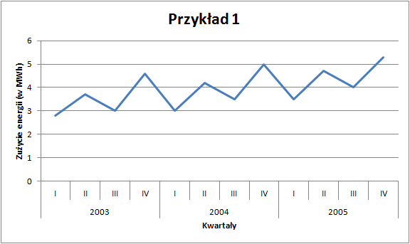
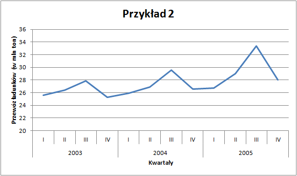
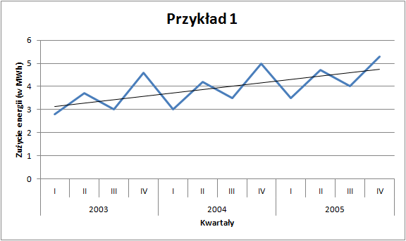
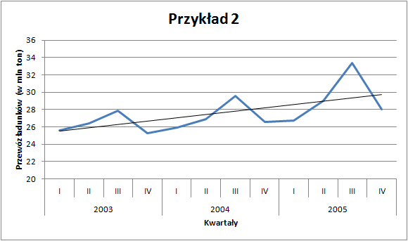
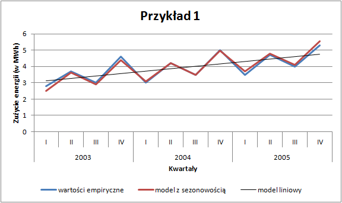
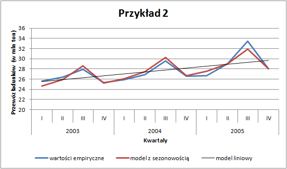

# Sezonowość

Jednym z rodzajów szeregu statystycznego jest szereg czasowy, który można zdefiniować jako ciąg obserwacji jakiegoś zjawiska w kolejnych jednostkach czasu (latach, kwartałach, miesiącach). Rozważane zjawisko może podlegać pewnym prawidłowościom, których wykrycie i opis jest celem analizy szeregów czasowych. Najczęściej rozważa się cztery czynniki wpływające na rozwój zjawiska w czasie:

- trend ($T_t$) --- długookresowe, systematyczne zmiany, jakim podlega dane zjawisko,
- wahania sezonowe ($S_t$) --- regularne odchylenia od tendencji rozwojowej (trendu) związane np. z porami roku (warunkami klimatycznymi),
- wahania cykliczne ($C_t$) --- związane z cyklem koniunkturalnym, 
- wahania przypadkowe ($I_t$) --- nieregularne zmiany.

Analiza danych, które mogą charakteryzować się sezonowością rozpoczyna się od wizualizacji oraz estymacji parametrów modelu liniowego. W tym celu posłużymy się dwoma przykładami. Pierwszy będzie dotyczył zużycia energii elektrycznej, a drugi przewozów ładunków w Polsce - [plik](zbiory/sezonowosc.xlsx).

W obu przypadkach dysponujemy danymi kwartalnymi za lata 2003--2005. Na pierwszy rzut oka możemy wskazać pewne prawidłowości: zużycie energii jest widocznie wyższe w drugich i czwartych kwartałach analizowanych lat. Z kolei przewozy ładunków wzrastają od kwartału pierwszego do trzeciego (w którym osiągają maksimum w danym roku), by następnie spaść. 

Celem analizy będzie ilościowe określenie wielkości zmian sezonowych, tak aby było możliwe prognozowanie z uwzględnieniem tych czynników. 

## Trend liniowy

Pierwszym krokiem w analizie szeregu czasowego jest estymacja parametrów trendu liniowego. 

Dla przykładu pierwszego dotyczącego zużycia energii funkcja regresji przyjmuje następującą postać:

$$\hat{y}_{t}=0,15 \cdot t+2,99$$

w której współczynnik kierunkowy informuje o tym, że z kwartału na kwartał zużycie energii rosło przeciętnie o 0,15 MWh. Z kolei wyraz wolny równy 2,99 oznacza, że w okresie $t=0$ czyli w IV kwartale 2002 roku, teoretyczne zużycie energii wynosiło 2,99 MWh.

W drugim z analizowanych przykładów --- przewozów ładunków --- model wyglądał następująco:

$$\hat{y}_{t}=0,38 \cdot t+25,13$$

co oznacza, że z kwartału na kwartał przewóz ładunków wzrastał średnio o 0,38 mln ton, natomiast w IV kwartale 2002 roku modelowa wartość przewozów ładunków wynosiła 25,13 mln ton.

Na podstawie wyznaczonych funkcji regresji można obliczyć wartości teoretyczne ($\hat{y}_t$) zużycia energii oraz przewozów ładunków i pod postacią prostej przestawić na wykresie.

Otrzymane wartości wynikające z funkcji trendu ($\hat{y}_t$) mają charakter liniowy i prawdę rzecz ujmując słabo dopasowują się do danych empirycznych. Współczynnik $R^2$ w przykładzie pierwszym wynosi 41%, a w przykładzie drugim tylko 37%. Ponadto, jeśli chcielibyśmy prognozować na kolejne okresy to według funkcji trendu wartości zużycia energii dla kwartałów pierwszych byłyby przeszacowane, a dla kwartałów czwartych niedoszacowane. Stąd zachodzi potrzeba uwzględnienia w modelu występowania sezonowości, którą obserwujemy w danych.

Pierwszym krokiem jest identyfikacja rodzaju tej sezonowości. Może ona mieć charakter addytywny --- wtedy wahania sezonowe są stałe w poszczególnych okresach (por. przykład 1) lub multiplikatywny, kiedy czynniki sezonowe są proporcjonalne do funkcji trendu (por. przykład 2). W zależności od zidentyfikowanego charakteru należy obliczyć wskaźniki sezonowości. W pierwszej kolejności rozważymy model addytywny.

## Model addytywny

Analizę modelu addytywnego należy rozpocząć od wyznaczenia różnic pomiędzy wartościami empirycznymi ($y$) a modelowymi ($\hat{y}$) dla poszczególnych okresów zgodnie ze wzorem:

$$S^i_t=y_t-\hat{y}_t$$

Następnie dla każdego z analizowanych podokresów (półroczy, kwartałów, miesięcy) oblicza się surowe wskaźniki sezonowości uśredniając wyznaczone wcześniej różnice:

$$S_i=\frac{\sum\limits_{i=1}^{m}{S_t^i}}{p}$$

gdzie:

- $m$ --- liczba podokresów (półroczy, kwartałów, miesięcy),
- $p$ --- liczba analizowanych lat.

W analizowanym przez nas przykładzie musimy wyznaczyć surowe wskaźniki sezonowości dla każdego kwartału. Ponadto jeśli spełniona będzie zależność $\sum\limits_{i=1}^{m}{S_i}=0$ to oznacza, że wskaźniki sezonowości są wolne od wahań przypadkowych. W praktyce jednak rzadko zdarza się taka sytuacja. W takim przypadku należy jeszcze wyznaczyć współczynnik korygujący zgodnie z wzorem:

$$k=\frac{\sum\limits_{i=1}^{m}{S_i}}{m}$$

a następnie skorygować surowe wskaźniki sezonowości według formuły

$$So_{i}=S_i-k$$

otrzymując tzw. oczyszczone wskaźniki sezonowości, które informują o średnich odchyleniach od funkcji trendu w poszczególnych podokresach. Dla tych wskaźników zachodzi zależność: $\sum\limits_{i=1}^{m}{So_{i}}=0$. W przykładzie 1 oczyszczone wskaźniki sezonowości dla poszczególnych kwartałów są równe:

| Wskaźnik | Wartość | Interpretacja                                                                                                          |
|----------|---------|------------------------------------------------------------------------------------------------------------------------|
| $So_{1}$ | -0,62   | w pierwszych kwartałach lat 2003--2005 zużycie energii było mniejsze średnio o 0,62 MWh niż wynika to z funkcji trendu |
| $So_{2}$ | 0,33    | w drugich kwartałach lat 2003--2005 zużycie energii było większe średnio o 0,33 MWh niż wynika to z funkcji trendu     |
| $So_{3}$ | -0,51   | w trzecich kwartałach lat 2003--2005 zużycie energii było mniejsze średnio o 0,51 MWh niż wynika to z funkcji trendu   |
| $So_{4}$ | 0,81    | w czwartych kwartałach lat 2003--2005 zużycie energii było większe średnio o 0,81 MWh niż wynika to z funkcji trendu   |
| Suma     | 0,00    | wskaźniki sezonowości są wolne od wahań przypadkowych                                                                  |

Kolejnym etapem analizy jest wyznaczenie zmodyfikowanych wartości teoretycznych uwzględniających sezonowość. Te wartości oznaczane jako $\hat{y}^*$ uzyskujemy dodając do wartości teoretycznych ($\hat{y}$) odpowiednie dla poszczególnych podokresów oczyszczone wskaźniki sezonowości $So_i$. Formalny zapis jest następujący:

$$\hat{y}^*=\hat{y}+So_i$$

Wartości $\hat{y}^*$ przedstawione na wykresie już znacznie lepiej pasują do posiadanych danych empirycznych:
 

Na podstawie tak zmodyfikowanego modelu można prognozować przyszłe wartości z dużo większą precyzją. Prognozowanie w modelu addytywnym polega na podstawieniu numeru okresu dla którego się prognozuje do funkcji trendu, a następnie dodanie odpowiedniego wskaźnika sezonowości:

$$\hat{y}_{T}^{P}=\hat{y} + So_i=a_1 \cdot T + a_0 + So_i$$

Interesuje nas prognozowane zużycie energii w IV kwartale 2008 roku. Ten okres przyjmuje wartość $t=24$, natomiast wskaźnik sezonowości dla czwartego kwartału jest równy 0,81 MWh. Powyższe wartości podstawiamy do wzoru:

$$\hat{y}_{24}^{P}=0,15 \cdot 24 + 2,99 + 0,81 = 7,4$$

co oznacza, że prognozowane zużycie energii w IV kwartale 2008 roku wyniesie 7,4 MWh.

## Model multiplikatywny

W modelu multiplikatywnym zamiast różnic pomiędzy wartościami teoretycznymi a modelowymi oblicza się ich iloraz zgodnie ze wzorem:

$$S^i_t=\frac{y_t}{\hat{y}_t}$$

Następnie dla każdego z analizowanych podokresów (półroczy, kwartałów, miesięcy) oblicza się surowe wskaźniki sezonowości uśredniając wyznaczone wcześniej ilorazy:

$$S_i=\frac{\sum\limits_{i=1}^{m}{S_t^i}}{p}$$

gdzie: 

- $m$ --- liczba podokresów (półroczy, kwartałów, miesięcy),
- $p$ --- liczba analizowanych lat.

W analizowanym przez nas przykładzie musimy wyznaczyć surowe wskaźniki sezonowości dla każdego kwartału. W przypadku sezonowości multiplikatywnej zależność oznaczająca, że wskaźniki sezonowości są wolne od wahań przypadkowych jest wyrażona następująco: $\sum\limits_{i=1}^{m}{S_i}=m$. W praktyce jednak rzadko zdarza się taka sytuacja. W takim przypadku należy jeszcze wyznaczyć współczynnik korygujący zgodnie z wzorem:

$$k=\frac{\sum\limits_{i=1}^{m}{S_i}}{m}$$

a następnie skorygować surowe wskaźniki sezonowości według formuły

$$So_{i}=S_i/k$$

otrzymując tzw. oczyszczone wskaźniki sezonowości, które informują o średnich odchyleniach od funkcji trendu w poszczególnych podokresach. Dla tych wskaźników zachodzi zależność: $\sum\limits_{i=1}^{m}{So_{i}}=m$. W przykładzie 2 oczyszczone wskaźniki sezonowości możemy zapisać w postaci procentowej i dla poszczególnych kwartałów są równe:

| Wskaźnik | Wartość | Interpretacja                                                                                                          |
|----------|---------|------------------------------------------------------------------------------------------------------------------------|
| $So_{1}$ | 96,5%   | w pierwszych kwartałach lat 2003--2005 rzeczywiste przewozy były średnio o 3,5% niższe niż wynika to z funkcji trendu |
| $So_{2}$ | 100,1%    | w drugich kwartałach lat 2003--2005 rzeczywiste przewozy były średnio o 0,1% wyższe niż wynika to z funkcji trendu     |
| $So_{3}$ | 108,9%   | w trzecich kwartałach lat 2003--2005 rzeczywiste przewozy były średnio o 8,9% wyższe niż wynika to z funkcji trendu   |
| $So_{4}$ | 94,5%    | w czwartych kwartałach lat 2003--2005 rzeczywiste przewozy były średnio o 5,5% niższe niż wynika to z funkcji trendu   |
| Suma     | 400,00%    | wskaźniki sezonowości są wolne od wahań przypadkowych  

Kolejnym etapem analizy jest wyznaczenie zmodyfikowanych wartości teoretycznych uwzględniających sezonowość. Te wartości oznaczane jako $\hat{y}^*$ uzyskujemy mnożąc wartości teoretyczne ($\hat{y}$) odpowiednie dla poszczególnych podokresów przez oczyszczone wskaźniki sezonowości $So_i$. Formalny zapis jest następujący:

$$\hat{y}^*=\hat{y} \cdot So_i$$

Wartości $\hat{y}^*$ przedstawione na wykresie już znacznie lepiej pasują do posiadanych danych empirycznych:

Na podstawie tak zmodyfikowanego modelu można prognozować przyszłe wartości z dużo większą precyzją. Prognozowanie w modelu multiplikatywnym polega na podstawieniu numeru okresu dla którego się prognozuje do funkcji trendu, a następnie przemnożenie przez odpowiedni wskaźnik sezonowości:

$$\hat{y}_{T}^{P}=\hat{y} \cdot So_i=(a_1 \cdot T + a_0) \cdot So_i$$

Interesuje nas prognozowane zużycie energii w III kwartale 2006 roku. Ten okres przyjmuje wartość $t=15$, natomiast wskaźnik sezonowości dla kwartału trzeciego jest równy 108,9%. Powyższe wartości podstawiamy do wzoru:

$$\hat{y}_{15}^{P}=(0,38 \cdot 15 + 25,13) \cdot 108,9\% = 33,6$$

co oznacza, że prognozowane przewozy ładunków w III kwartale 2006 roku wyniosą 33,6 mln ton.

## Ocena jakości

Ostatnim elementem analizy sezonowości jest ocena jakości otrzymanego modelu. W takim przypadku nie wyznaczamy współczynnika $R^2$ ponieważ z definicji dotyczy on wyłącznie zależności liniowej. Główną miarą jakości będzie odchylenie standardowe składnika resztowego z uwzględnieniem sezonowości:

$$S_u^*=\sqrt{\frac{\sum\limits_{t=1}^{n}{(y_t-\hat{y}_t^*)^2}}{n-2}}$$

Licznik odchylenia standardowego zawiera sumę kwadratów odchyleń wartości empirycznych ($y_t$) od wartości modelowych z sezonowością ($\hat{y}_t^*$). Nie ma już tutaj znaczenia czy model był addytywny czy multiplikatywny.

W przykładzie pierwszym $S_u^*$ wynosiło 0,16 MWh, co oznacza, że rzeczywiste zużycie energii różni się od zużycia teoretycznego wyznaczonego na podstawie szeregu czasowego średnio o +/- 0,16 MWh. Z kolei w przykładzie drugim $S_u^*$ wynosiło 0,74 mln ton, a co za tym idzie rzeczywiste przewozy różnią się od przewozów teoretycznych uzyskanych w oparciu o model szeregu czasowego średnio o +/- 0,74 mln ton. 

## Błąd prognozy

Wyliczona wartość $S_u^*$ niezbędna jest przy wyznaczaniu błędu prognozy zgodnie ze wzorem:

$$D(y_{T}^{P})=S_u^{*}\sqrt{1+\frac{1}{n}+\frac{(T-\bar{t})^2}{\sum\limits_{t=1}^{n}{(t-\bar{t})^2}}}$$

w którym uwzględniamy możliwość wzrostu tego błędu wraz z oddalaniem się od zakresu danych, które posiadamy.

Dla analizowanych przykładów otrzymano następujące błędy prognozy:

- przykład 1 --- zużycie energii

Przy prognozie dla IV kwartału 2008 roku

$$D(y_{24}^{P})=0,29$$

co oznacza, że prognozowane zużycie energii w IV kwartale 2008 roku wyniesie 7,4 +/- 0,29 MWh.
- przykład 2 --- przewóz ładunków

Przy prognozie dla III kwartału 2006 roku

$$D(y_{24}^{P})=0,93$$

co oznacza, że prognozowane przewozy w III kwartale 2006 roku wyniosą 33,6 +/- 0,93 mln ton.

Na podstawie otrzymanych prognoz oraz ich błędów można wyznaczyć przedziały, w których spodziewamy się wartości rzeczywistej.
